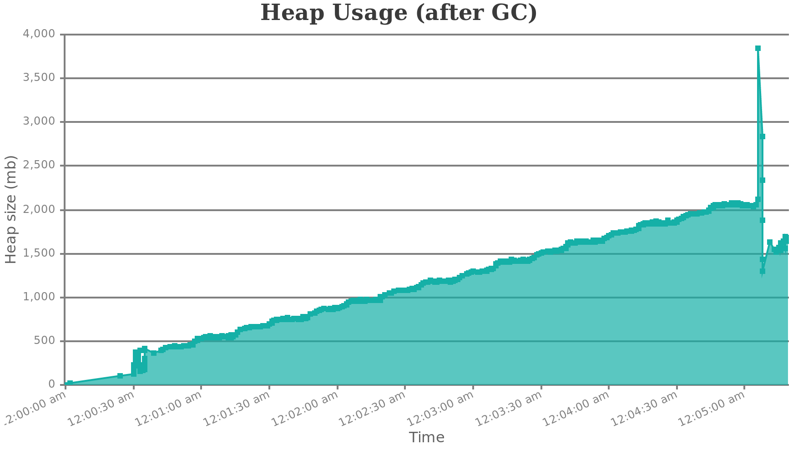
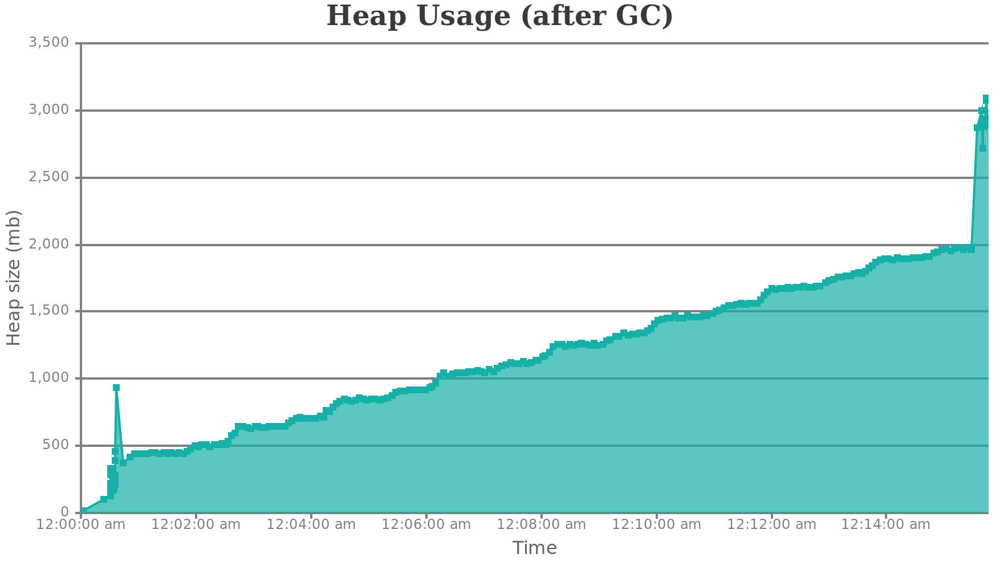
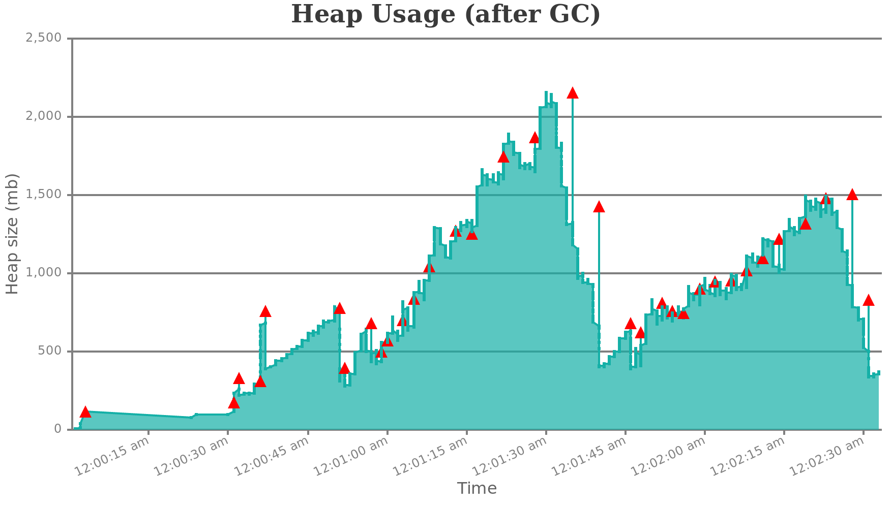
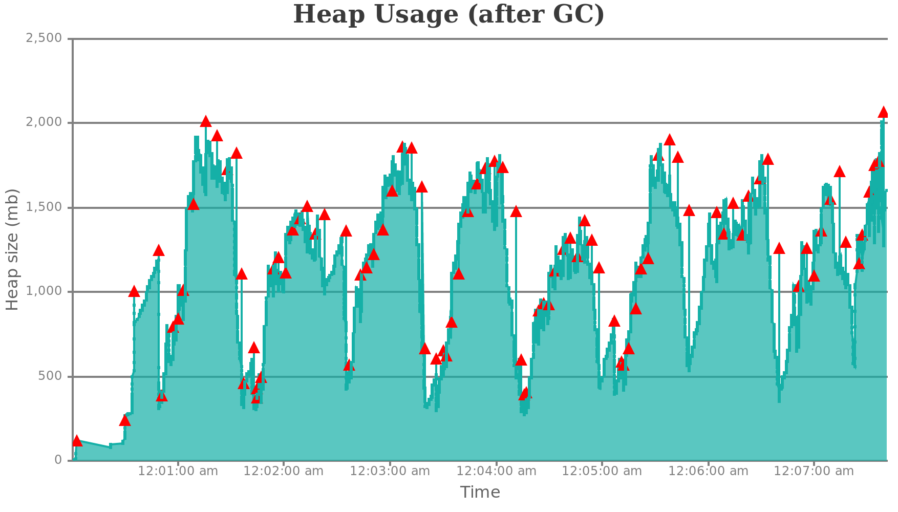

# Message deserialization performance

[Bug 1481281](https://bugzilla.mozilla.org/show_bug.cgi?id=1481281) - Benchmark `Dataset.toJValue` against `Dataset.fieldsAsMap`

## Background

Spark runs on the Java Virtual Machine and inherits some its runtime characteristics.
The object lifecycle is opaque in the DataFrame API, but becomes more of a concern when using the lower level RDD API.
Tuning the garbage collector and being mindful of the underlying VM can improve performance.

Our general use-case of the RDD API is working with semi-unstructured data represented as JSON and Heka.
In `MainSummaryView`, binary data containing JSON is transformed and flattened into a format that can be converted into a DataFrame.
This conversion of semi-unstructured to structured data is done by serializing data using an in-memory object representation.

In [Bug 1419116](https://bugzilla.mozilla.org/show_bug.cgi?id=1419116), the `Message.toJValue` method was added for
abstracting access to the full JSON document from the underlying storage.
This is similar to how the python implementation of the library works.
The micro-benchmarks showed that there was overhead in creating this view.
When the method was used in `MainSummaryView`, the overall time decreased by a factor of 1.5-2.0x.
[Bug 1436850](https://bugzilla.mozilla.org/show_bug.cgi?id=1436850) is introduces the changes and some initial benchmarking.

The cause of the improvement is hard to pin down, but indicators from the Spark UI point to the decreased load on the garbage collector.
In this benchmark, we perform another set of micro-benchmarks and re-run the `MainSummaryView` jobs using alternative garbage collection methods.

## Experimental Setup

This benchmark is split into two separate parts.
The first is a micro-benchmark that is meant to be run on Spark through the moztelemetry API.
JSON data in the shape of a tree is generated in `MessageGenerator`.
The number of nodes in the resulting Heka data-set can be controlled as parameters in the generator.
The data is then fed into a Spark application that performs tree unnesting to create a flat data structure.
The goal of this benchmark is to see how Spark reacts with data larger than the heap.

1. Generate two datasets, a baseline with 5^3 leaf nodes and a wide set with 10^4 leaf nodes, stored as Heka protobuf
2. Run the tree flattening application using both the `toJValue` and `fieldsAsMap` methods on the `Message` object
3. Collect timings

Refer to the deserialization benchmark in this repo.

```bash
$ ./run_deserialization.sh
```

In the second benchmark, we rerun `MainSummaryView` using two revisions in the source tree.

The [first revision](https://github.com/mozilla/telemetry-batch-view/commit/bb1abf1cf631f5263ade0c2f4aab0b4ac4831dc3) is a snapshot of the job prior to the use of `Message.toJValue`.
The [second revision](https://github.com/mozilla/telemetry-batch-view/commit/6df421c98e309f2a0417a96c39401e6807f3e580) uses `JValues` from the start.

The diff between the revisions is available [here](https://github.com/mozilla/telemetry-batch-view/compare/bb1abf1cf631f5263ade0c2f4aab0b4ac4831dc3...6df421c98e309f2a0417a96c39401e6807f3e580).

1. Build the assembly jars of the two revisions, with a patch to enable equally-sized-partition packing
2. Run `MainSummaryView` on a single day of Firefox nightly
    - Repeat for each jar using the Concurrent Mark Sweep and G1 methods
3. Collect timings
4. Request the GC logs from yarn

Refer to the main summary benchmark.

```
# SSH into an EMR spark cluster and change to a working directory
$ ./run_main_summary.sh
```

## Results

### Tree-flattening microbenchmark

The datasets in the results are generated with the following parameters.
These can be adjusted to increase the total number of objects that are created when deserializing.

dataset | width | depth | branch factor | total leaf nodes | total rows
---|---|---|---|---|---
baseline | 5 | 3 | 5 | 125 | 10000
wide | 10 | 4 | 10 | 10,000 | 1700

The baseline and wide datasets have differing number of rows, but are large enough such that they do not fit directly into memory.
Within each dataset, the map and jvalue methods can be compared relative to each other.

dataset  | method | userland (sec) | kernel (sec) | elapsed (mm:ss)
---------|--------|----------|--------|---
baseline | map    | 237.67   | 2.31   | 2:04.48
baseline | jvalue | 282.86   | 3.63   | 2:33.80
wide     | map    | 672.44   | 2.89   | 5:47.62
wide     | jvalue | 1367.46  | 4.54   | 12:12.43

The map method has less overhead in this context.
In the baseline, the difference is fairly small.
When the number of parsed objects is increased to 10,000 nodes per row, the timing difference is more apparent.

### MainSummaryView benchmark

The job is run twice with each revision.
The JValue method was introduced in [this PR](https://github.com/mozilla/telemetry-batch-view/pull/377).

method | gc | userland (sec) | kernel (sec) | elapsed (mm:ss)
---|---|---|---|---
jvalue | cms | 71.43 | 8.92 | 8:38.81
jvalue | g1 | 68.33 | 9.15  |6:17.00
map | cms | 71.94 | 8.89 | 14:56.84
map | g1 | 70.51 | 9.36 | 16:43.99

The JValue method is consistently faster than the original `fieldsAsMap` methodology.
This timing corresponds to the overall GC time measured in the Spark UI dashboard.
The following graphs show heap usage over the course of the jobs.

#### toJValue with Concurrent Mark Sweep


The CMS garbage collector shows a steady increase in the heap usage over the course of the application.
Heap usage reaches 2000 MB after 5 minutes.

#### fieldsAsMap with Concurrent Mark Sweep


The heap usage follows the same pattern as the CMS with the `toJValue` method.
However, the heap reaches 2000 MB after 14 minutes.

#### toJValue with G1


G1 has a small periodic sawtooth behavior that reaches a peak of 2000 MB.
This method performs better than CMS on the same method.


#### fieldsAsMap with G1


G1 with the Map method has a smaller sawtooth period than the JValue method.
The garbage collector more frequently clears the heap of unused objects.

## Discussion

The microbenchmarks show that there are no clear performance wins for the `Message.toJValue` method.
The baseline and wide tests show that there is measurable overhead involved with reconstructing the document structure.
It's unclear what conditions need to be met in order to produce the behavior seen in `MainSummaryView`.
Given the small dataset size, it's assumed that the performance will extrapolate linearly with the amount of data.
When the size of the dataset is as large as `main_summary`, this assumption may not hold.
However, the `JValue` method is more concise than it's `Map[String, Any]` equivalent and has the nice property of logically reconstructing
the ping.

For `MainSummaryView`, the logs collected from Yarn seem to point to object management and improved garbage collection for increased job efficiency.
For reference, the GC hours in the Spark UI for the JValue method is smaller than the Map method (1.8h vs 4h).
The results of the CMS GC in both `toJValue` and `fieldsAsMap` share a similar shape.
The steady increase in heap usage in the CMS graph is likely the overhead required to keep track of the RDD.
However, when comparing the G1 GC, there is a more frequently occurring sawtooth behavior in `fieldsAsMap`.
This implies that there are more objects being created and swept over the duration of the job.
This may also relate why G1 more effective on the JValue method than it is on the Map method.
Overall, there is not a significant difference between choosing different garbage collection methods.
The difference in speed likely stems to improvements in the code.

In addition to the profiling, we can also look at [the PR diff](https://github.com/mozilla/telemetry-batch-view/pull/377/files) for some potentials causes of the performance difference.
One significant change is the use of the `JValue.extractOpt[T]` method for extracting values from the document.
For example, the following snippet

```scala
val fields = message.fieldsAsMap
lazy val build = parse(fields.getOrElse("environment.build", "{}").asInstanceOf[String])
val client_id = build \ "buildId" match {
    case JString(x) => x
    case _ => null
}
```

can be rewritten as

```scala
val doc = message.toJValue.get
val build = doc \ "environment" \ "build"
(build \ "buildId").extractOpt[String]
```

The overhead of the parsing the JSON is moved into the `toJValue` method, which is observed in the microbenchmark.
A more subtle optimization involves removing the lazy evaluation on the `build` object.
There is overhead involved with checking whether the variable has been evaluated or not before.
This behavior was not specifically measured here, but it may contribute to the speedup by avoiding [synchronized blocks](http://scala-programming-language.1934581.n4.nabble.com/scala-Lazy-val-and-synchronized-td1991409.html).

Tuning garbage collection can modestly improve performance (here by a factor of 1-2x).
Understanding that the garbage collection can have a significant effect can help in the performance tasks like data serialization.
For tasks that process a significant amount of data like MainSummaryView and LongitudinalView, it may help to perform some profiling and optimization.
It may be interesting to profile some of the jobs using tools like the [Uver JVM Profiler](https://github.com/uber-common/jvm-profiler), designed to collect metrics in a distributed JVM setting.
The resulting graphs and stats may provide some insight on how to better implement data transformations.

## Resources

* [Tuning Java Garbage Collection for Apache Spark Applications](https://databricks.com/blog/2015/05/28/tuning-java-garbage-collection-for-spark-applications.html)
* [Tuning Spark](https://spark.apache.org/docs/latest/tuning.html)
* [Getting Started with the G1 Garbage Collector](http://www.oracle.com/technetwork/tutorials/tutorials-1876574.html)
* [GCEasy - Analysis of GC logs](http://gceasy.io/index.jsp)
